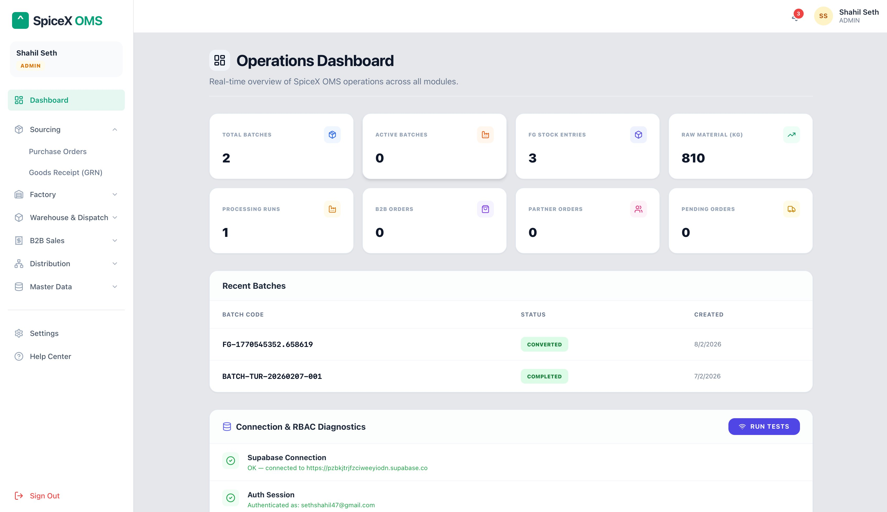

# SpiceX OMS — Operations Management System

> A full-stack enterprise Operations Management System built to manage end-to-end operations across sourcing, factory processing, warehousing, B2B sales, and distribution — for a premium Himalayan spice brand.

---

## Dashboard Preview



Live Demo: https://frontend-67mgd7w26-shahil-seths-projects.vercel.app/dashboard

---

## Important Note on Availability

This project is hosted on the free tier of Supabase. Free Supabase projects are automatically paused after 1 week of inactivity.

If the live demo is not working:
- The database may be paused
- Reach out to me directly and I will get it back up: shahilseth6@gmail.com
- Or clone the repo, set up your own Supabase project, and run it locally

---

## About the Project

SpiceX OMS is a full-stack internal operations platform built to handle the complete supply chain of a Himalayan spice business — from farmer procurement to finished goods dispatch.

The system provides full traceability from Farmer to Purchase Order to GRN to Batch to Finished Goods to Dispatch, with role-based access for every team member across multiple locations.

---

## Business Locations

| Location | Type | Operations |
|---|---|---|
| Namsai, Arunachal Pradesh | Factory | Ginger and Turmeric processing |
| Dimapur, Nagaland | Factory | Ginger and Turmeric processing |
| Guwahati, Assam | Central Warehouse | Finished goods storage and dispatch |
| Imphal, Manipur | Regional Warehouse | Cinnamon storage and regional distribution |

---

## Tech Stack

| Layer | Technology |
|---|---|
| Frontend | Next.js 14, TypeScript, Tailwind CSS |
| Backend | Supabase (PostgreSQL) |
| Auth | Supabase Auth with RBAC |
| ORM | supabase-js |
| Deployment | Vercel (Frontend), Supabase Cloud (DB) |

---

## Database Schema

Tables: suppliers, skus, purchase_orders, grns, batches, raw_material_inventory, finished_goods_inventory

Full traceability chain: Finished Goods → SKU → Batch → GRN → Purchase Order → Supplier (Farmer/FPO)

---

## Role-Based Access Control

9 roles with scoped module access:

| Role | Key Permissions |
|---|---|
| Admin | Full access to all modules |
| Sourcing Manager | Purchase Orders, Supplier management |
| Factory Manager | GRN, Production, Batch management, FG Inventory |
| B2B Sales Manager | Orders, Inventory view, Customer management |
| Warehouse Executive | Fulfillment, Dispatch operations |
| Warehouse Manager | Full warehouse, Dispatch register |
| Distribution Manager | Partner management, Margin settings |
| Sales Person | Partner sales tracking, Order creation |
| Distributor / Franchisee | Order approval, GRN confirmation |

Each role sees only their relevant modules and data.

---

## Modules

1. Sourcing and Procurement
- Supplier master (Farmer / FPO / Vendor)
- Purchase Order creation with fields: State, Block, Area, FPO/Vendor, Product, Quantity, Rate, Dry/Fresh, Delivery Date, Dispatch Location
- PO to GRN linkage
- Quality status at GRN level
- Payment update tracking

2. Factory Operations
- Material receiving and GRN interface
- Raw material inventory (Namsai and Dimapur)
- Processing tracking: Fresh Weight to Slice Weight to Drying Time to Dry Weight
- Dehydrator and Solar Tunnel Dryer tracking
- Finished Goods inventory update
- Factory dispatch records

3. Batch and Traceability
- Batch creation against GRN
- Raw Material Inventory per batch
- Finished Goods Inventory per batch and SKU
- Full trace: FG to SKU to Batch to GRN to PO to Supplier

4. Warehouse Management
- Stock inventory management
- Order fulfillment across all channels (Distributor / Franchisee / Online)
- Monthly packing summary: Packed Qty, Dispatched Qty, Balance in Stock
- Dispatch register by channel

5. B2B Sales Management
- Inventory dashboard for warehouse team
- B2B order creation (Email / Phone / WhatsApp source)
- Fulfillment dashboard
- Dispatch update with tracking
- Invoice creation with GST
- Order tracking with payment status

6. Distributors and Franchisee Management
- Add / edit partners
- Margin settings per partner
- Auto pricing: Selling Price = MRP - (MRP x Margin%)
- Salesperson assignment to partners
- Order creation on behalf of partners
- Order approval by distributor / franchisee
- GRN confirmation and payment tracking

7. Master Data
- Product Master: SKU Code, Product Name, Category, UoM, MRP, Status
- Supplier Master
- Customer Master (B2B, GST details)
- Partner Master (margins)
- Location Master
- User Master

---

## UI Overview

- Login Page — Role-based authentication via Supabase Auth
- Admin Dashboard — 8 metric cards: Total Batches, Active Batches, FG Stock Entries, Raw Material (KG), Processing Runs, B2B Orders, Partner Orders, Pending Orders
- Sidebar Navigation: Sourcing, Factory, Warehouse and Dispatch, B2B Sales, Distribution, Master Data, Settings, Help Center

---

## Project Status

| Phase | Description | Status |
|---|---|---|
| Phase 1 | Master Data (Supplier and SKU) | Complete |
| Phase 2 | Procurement and Inbound Flow (PO, GRN, Quality) | Complete |
| Phase 3 | Batch and Traceability | Complete |
| Phase 4 | Production and Consumption (RM to WIP to FG) | In Progress |
| Phase 5 | APIs and Integrations (Traceability, Inventory) | Planned |
| Phase 6 | Reporting and Audit (Batch Recall, Supplier Impact) | Planned |

---

## Getting Started

Prerequisites: Node.js 18+, npm or yarn, a Supabase account with a project set up

Installation:
```
git clone https://github.com/your-username/spicex-oms.git
cd spicex-oms
npm install
```

Environment Variables — create a .env.local file in the root directory:
```
NEXT_PUBLIC_SUPABASE_URL=your_supabase_project_url
NEXT_PUBLIC_SUPABASE_ANON_KEY=your_supabase_anon_key
```

Never commit .env.local to version control. It is already in .gitignore.

Running Locally:
```
npm run dev
```

Open http://localhost:3000 in your browser.

Note: The frontend (Next.js) and backend (Supabase) run independently. Supabase is a hosted cloud service — only the frontend needs npm run dev.

---

## Project Structure

```
spicex-oms/
├── app/
│   ├── (auth)/login/
│   ├── (dashboard)/
│   │   ├── dashboard/
│   │   ├── sourcing/
│   │   ├── factory/
│   │   ├── warehouse/
│   │   ├── b2b-sales/
│   │   ├── distribution/
│   │   └── master-data/
│   └── layout.tsx
├── components/ui/ and shared/
├── lib/supabase.ts
├── types/
└── public/
```

---

## Security Notes

- All database access is controlled via Supabase Row Level Security (RLS) policies
- Each role is restricted to their data scope at the database level
- Auth tokens are managed by Supabase Auth — no custom JWT handling

---

## Built By

Shahil Seth
BTech CSE — Final Year
Email: shahilseth6@gmail.com

If the live demo is paused or unavailable, feel free to reach out — I will reactivate it or walk you through running it locally.

---

## License

This is a portfolio/internship project. Not licensed for commercial use or redistribution.
